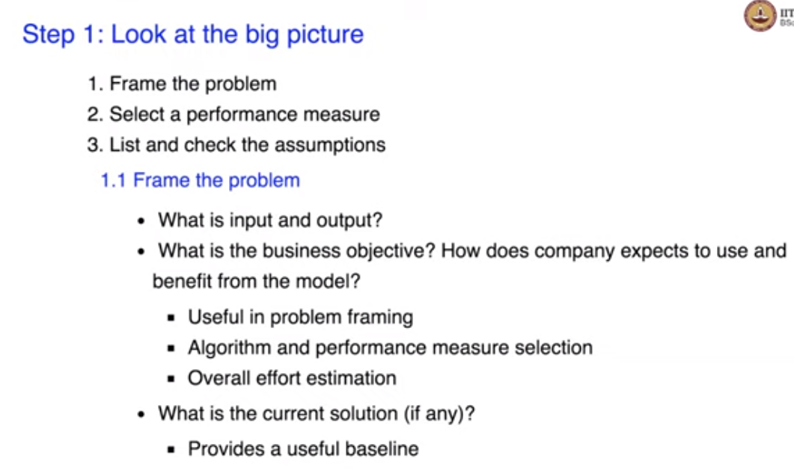
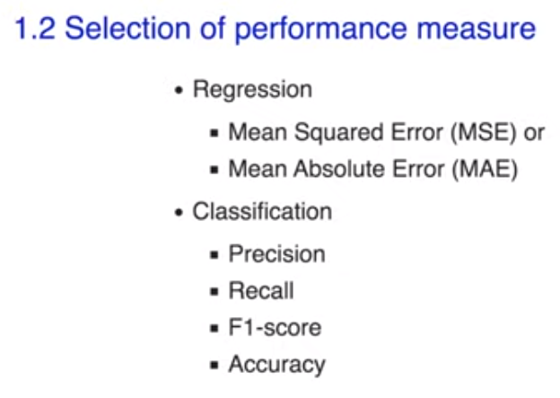
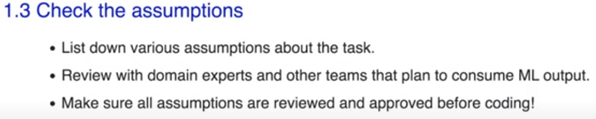

# Steps to start

#### The head method gives us first few rows or exactly five rows from the data frame.
    data.head()

#### The describe method gives us statistic about each feature or specifically it gives statistics about each column in the data frame. It prints counts and other statistical properties like mean, standard deviation and quartiles. 
    data.describe()

#### Here